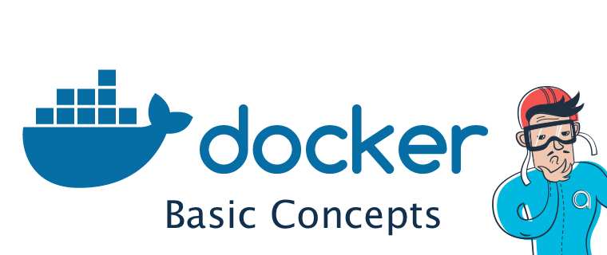

# Docker overview

The concept of containerization itself is pretty old. But the emergence of the Docker Engine in 2013 has made it much easier to containerize your applications.

According to the Stack Overflow Developer Survey - 2020, Docker is the #1 most wanted platform, #2 most loved platform, and also the #3 most popular platform.

As in-demand as it may be, getting started can seem a bit intimidating at first. So in this book, we'll be learning everything from the basics to a more intermediate level of containerization. After going through the entire book, you should be able to:

* Containerize (almost) any application
* Upload custom Docker Images to online registries
* Work with multiple containers using Docker Compose

## Prerequisites
* Familiarity with the Linux Terminal
* Familiarity with JavaScript (some later projects use JavaScript)

# The Docker platform
Docker provides the ability to package and run an application in a loosely isolated environment called a container. The isolation and security allows you to run many containers simultaneously on a given host. Containers are lightweight and contain everything needed to run the application, so you do not need to rely on what is currently installed on the host. You can easily share containers while you work, and be sure that everyone you share with gets the same container that works in the same way.

Docker provides tooling and a platform to manage the lifecycle of your containers:

* Develop your application and its supporting components using containers.
* The container becomes the unit for distributing and testing your application.
* When you’re ready, deploy your application into your production environment, as a container or an orchestrated service. This works the same whether your production environment is a local data center, a cloud provider, or a hybrid of the two.

Docker is an open platform for developing, shipping, and running applications. Docker enables you to separate your applications from your infrastructure so you can deliver software quickly. With Docker, you can manage your infrastructure in the same ways you manage your applications. By taking advantage of Docker’s methodologies for shipping, testing, and deploying code quickly, you can significantly reduce the delay between writing code and running it in production.